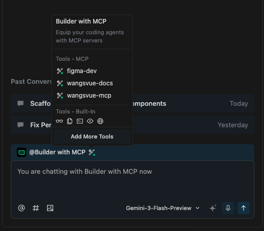
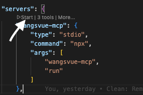
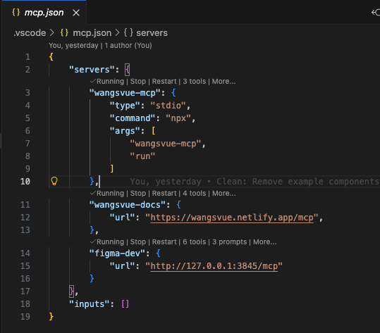
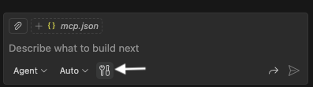
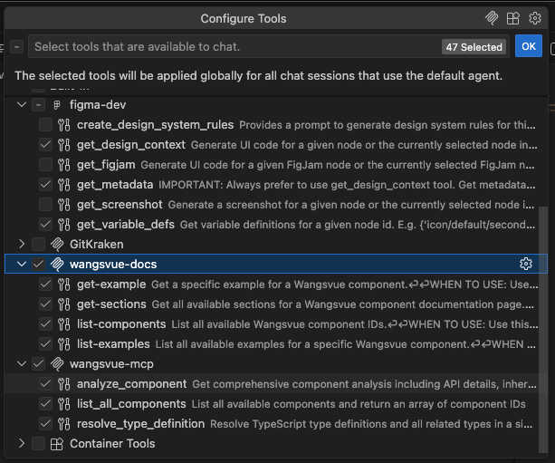

# Working with WangsVue

WangsVue is our Design System Component Library for Vue.js 3, powered by Tailwind CSS. To get the most out of WangsVue when developing with AI, we use the **Model Context Protocol (MCP)**.

This guide will walk you through setting up the WangsVue MCP server. We primarily recommend **Trae IDE** for the best integrated experience, but **GitHub Copilot** is also fully supported as an alternative.

***

## Preferred: Setup in Trae

Trae provides a seamless integration with MCP servers and is the recommended editor for WangsVue development.

### Step 1: Configure MCP

1. Press `Cmd + Shift + P` (or `Ctrl + Shift + P` on Windows) to open the Command Palette.
2. Search for `Preference: Open MCP Config (JSON)`.
3. Paste the following configuration into the file:

```json
{
  "mcpServers": {
    "wangsvue-mcp": {
      "command": "npx",
      "args": ["--prefix", "${workspaceFolder}", "wangsvue-mcp", "run"]
    },
    "wangsvue-docs": {
      "url": "https://wangsvue.netlify.app/mcp"
    },
    "figma-dev": {
      "url": "http://127.0.0.1:3845/mcp"
    }
  }
}
```

### Step 2: Initialize AI Rules and Skills

To give Trae the best context about WangsVue's coding standards, initialize the AI rules and skills by running the following command in your terminal:

```bash
npx wangsvue-mcp init trae
```

This will generate the necessary rules and skills files that Trae uses to understand the codebase structure, component library, and coding conventions.

### Step 3: Verify MCP Servers

1. Open the **AI Sidebar** in Trae (shortcut: `Cmd + U` on macOS / `Ctrl + U` on Windows).
2. Select the **Builder with MCP** agent.
3. Verify the connection by checking the **Tools** icon in the chat interface. A green indicator confirms that `wangsvue-mcp`, `wangsvue-docs`, and `figma-dev` are running. 
4. If a red indicator appears, reload the Trae window (`Developer: Reload Window`) to refresh the connection.

***

## Alternative: Setup in GitHub Copilot

If you prefer using VS Code with GitHub Copilot, follow these steps to manually configure the environment.

### Step 1: Initialize AI Rules and Skills

Provide GitHub Copilot with the "Master Operating Directive" for WangsVue:

```bash
npx wangsvue-mcp init copilot
```

**What this does:**

* Creates a `.github/instructions/Master Operating Directive.instruction.md` file.
* This file contains the essential context GitHub Copilot needs to write high-quality WangsVue code.

### Step 2: Configure MCP Servers

To enable real-time documentation and utility access:

1. Create or open `.vscode/mcp.json` in your project root.
2. Add the following configuration:

```json
{
  "servers": {
    "wangsvue-mcp": {
      "type": "stdio",
      "command": "npx",
      "args": ["wangsvue-mcp", "run"]
    },
    "wangsvue-docs": {
      "url": "https://wangsvue.netlify.app/mcp"
    },
    "figma-dev": {
      "url": "http://127.0.0.1:3845/mcp"
    }
  }
}
```

### Step 3: Start and Verify Servers

In VS Code, you may need to start the servers manually:

1. Open `.vscode/mcp.json`.
2. Look for the **"start"** button that appears above or next to each server definition.
3. Click **start** for all configured servers.\
   
4. Verify they show a 'Running' status.\
   

### Step 4: Enable Tools in Copilot

1. Open the **Copilot Chat** panel.
2. Switch to **Agent** mode.
3. Click the **Configure Tools** button. \
   
4. Enable the tools provided by `wangsvue-mcp` and `wangsvue-docs`. 
5. Click **OK**.

***

## Shared: Enable Figma Integration (Optional)

For both Trae and Copilot, if you want the AI to have access to your Figma designs, you need to enable the Figma MCP server locally.

1. Open **Figma Desktop**.
2. Enable the MCP server within Figma (see video below).
3. Ensure the server is running on `http://127.0.0.1:3845`.


